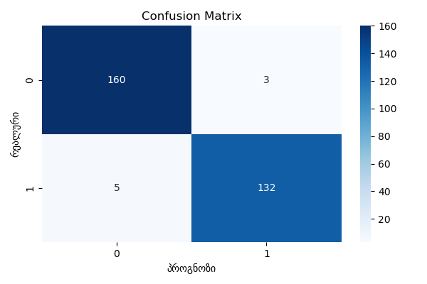

<pre>
<code markdown="1">
# საკრედიტო რისკის შეფასება ლოგისტიკური რეგრესიით

ამ პროექტის მიზანია ლოგისტიკური რეგრესიის გამოყენება საკრედიტო რისკის შეფასებისთვის.  
მოდელი პროგნოზირებს, დააბრუნებს თუ არა მომხმარებელი სესხს წარმატებით, ხელოვნურად შექმნილი `Risk` ცვლადის მიხედვით.

---

## 🔧 გამოყენებული ტექნოლოგიები

- Python
- pandas
- numpy
- scikit-learn
- matplotlib
- seaborn
- joblib

---

## 📁 ფოლდერის სტრუქტურა

```
german-credit-risk-logistic-regression/
├── data/
│   ├── german_credit_data.csv         # საწყისი მონაცემები
│   ├── X_train.csv / X_test.csv       # გაწმენდილი მონაცემები
│   ├── y_train.csv / y_test.csv       # მიზნობრივი ცვლადები
│   ├── logistic_model.joblib          # შენახული მოდელი
│   └── confusion_matrix.png           # მოდელის ვიზუალიზაცია
│
├── src/
│   ├── preprocess.py                  # მონაცემების გაწმენდა და გადამუშავება
│   └── train_model.py                 # მოდელის სწავლა, შეფასება და შენახვა
│
├── requirements.txt
└── README.md
```

---

## 📥 1. მონაცემების წინასწარი დამუშავება

ფაილი: `src/preprocess.py`

- წაიკითხავს `german_credit_data.csv` ფაილს
- წაშლის `Unnamed: 0` სვეტს
- ხელოვნურად შექმნის `Risk` ცვლადს შემდეგი ლოგიკით:
  - თუ არ აქვს „Saving accounts“ ან „Checking account“ **ან** თანხა > 5000 → `bad` (0)
  - სხვა შემთხვევაში → `good` (1)
- კატეგორიულ ცვლადებს გარდაქმნის One-Hot ფორმატში
- დაყოფს მონაცემებს 70/30-ზე და შეინახავს 4 ცალკე CSV ფაილად

გაშვება:
```bash
python src/preprocess.py
```

---

## 🧠 2. ლოგისტიკური რეგრესიის მოდელის აგება

ფაილი: `src/train_model.py`

- ჩატვირთავს CSV ფაილებად შენახულ მონაცემებს
- ააგებს ლოგისტიკურ მოდელს `LogisticRegression(max_iter=1000)`
- შეაფასებს `accuracy`, `confusion_matrix`, `classification_report`
- შეინახავს შედეგებს:
  - მოდელი: `data/logistic_model.joblib`
  - ვიზუალიზაცია: `data/confusion_matrix.png`

გაშვება:
```bash
python src/train_model.py
```

---

## 📦 3. შენახული მოდელის გამოყენება

შენახული მოდელის ხელახლა გამოყენება შესაძლებელია შემდეგნაირად:

```python
import joblib
model = joblib.load("data/logistic_model.joblib")
predictions = model.predict(X_new)
```

---

## 📈 ვიზუალიზაცია

მოდელის დაბნეულობის მატრიცა (confusion matrix):



---

## ✅ ინსტალაცია

დააინსტალირეთ საჭირო ბიბლიოთეკები:

```bash
pip install -r requirements.txt
```

---

## 📚 წყარო

მონაცემები მიღებულია Kaggle/დაფუძნებული რეალურ `German Credit Data` dataset-ზე.  
ტარგეტ ცვლადი `Risk` დამატებულია პირობითი ლოგიკით მხოლოდ სასწავლო მიზნებისთვის.
</code>
</pre>

